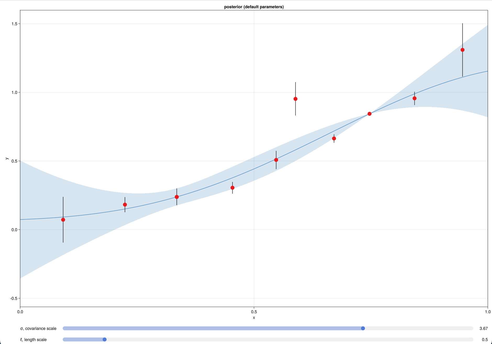

# InteractiveGPs

InteractiveGPs is a simple tool for interactive plotting and Gaussian process fitting.

__Installation__
`] add InteractiveGPs`


__Usage__
```julia
import InteractiveGPs
InteractiveGPs.launch()
```



- press `a` while hovering over the plot area to add a point
- press `d` while hovering over a point to delete it
- press `w` and `s` while hovering over a point to make its error bars wider and shorter, respectively